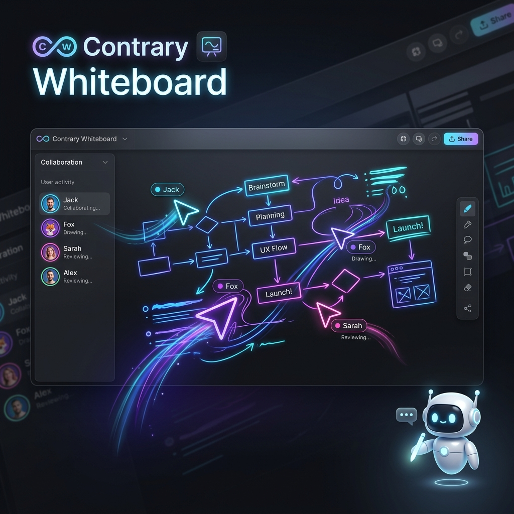

<p align="center">
  
</p>

<h1 align="center">✨ Contrary Whiteboard ✨</h1>

<p align="center">
  
  
  
  
</p>

<p align="center">
  <b>A professional, ultra-fast, real-time collaborative whiteboard designed for the modern age.</b><br/>
  Built with C++17 & Qt 6.8 — Engineered for performance, privacy, and seamless interaction.
</p>

<p align="center">
  <a href="#-features">Features</a> •
  <a href="#-download">Download</a> •
  <a href="#-quick-start">Quick Start</a> •
  <a href="#-tech-stack">Tech Stack</a>
</p>

---

## 🚀 Why Contrary Whiteboard?

Contrary Whiteboard is more than just a drawing app; it's a **real-time collaboration powerhouse**. Whether you're teaching a class, brainstorming with a global team, or sketching your next big idea, Contrary gives you the tools to do it with zero friction.

### ⚡ Performance First
No more "snapshot lag". Contrary uses a cutting-edge **Event Streaming Architecture** that broadcasts every stroke and cursor movement in under 5ms. 

### 🖋️ Stylus Pro & Input
Specifically optimized for Wacom, Huion, and iPad/Tablet users.
- **Ultra-Precision**: Reduced input latency by 5x (MIN_DISTANCE=2).
- **Pressure Sensitive**: True tapering and pressure-aware strokes (0.1 min scaling).
- **Pro Workflow**: Middle-click to pan/drag instantly; Stylus side-button temporary eraser.
- **Palm Rejection**: Intelligently ignores accidental touches when your pen is active.

---

## ✨ Features

<table width="100%">
  <tr>
    <td width="50%" valign="top">
      <h3>🌐 Real-Time Collaboration</h3>
      <ul>
        <li><b>One-Click Hosting</b>: Instant public URL via ngrok.</li>
        <li><b>Zero-Install Guests</b>: Anyone joins from a browser.</li>
        <li><b>Bi-directional Sync</b>: Everyone draws at once.</li>
        <li><b>Live Named Cursors</b>: See who is doing what.</li>
        <li><b>Follow Mode</b>: Lock guests to your view for presentations.</li>
      </ul>
    </td>
    <td width="50%" valign="top">
      <h3>🤖 AI & Intelligence</h3>
      <ul>
        <li><b>Private AI Assistant</b>: Local Qwen 2.5 LLM.</li>
        <li><b>100% Offline</b>: Your data never leaves your PC.</li>
        <li><b>Integrated Panel</b>: Ask questions while you draw.</li>
        <li><b>Fast Response</b>: Optimized for low-end hardware.</li>
      </ul>
    </td>
  </tr>
  <tr>
    <td width="50%" valign="top">
      <h3>📐 Creative Tools</h3>
      <ul>
        <li><b>Precision Instruments</b>: Ruler, Compass, Protractor.</li>
        <li><b>Media Rich</b>: Import PDFs, Images, Audio, Video.</li>
        <li><b>LaTeX Support</b>: Native math equation rendering.</li>
        <li><b>Dark Mode</b>: Premium, eye-friendly aesthetics.</li>
      </ul>
    </td>
    <td width="50%" valign="top">
      <h3>⚙️ Customization</h3>
      <ul>
        <li><b>Keyboard Shortcuts</b>: Fully remappable keys (P, E, M, etc.).</li>
        <li><b>Button Mapping</b>: Set your stylus buttons to any tool.</li>
        <li><b>Open Formats</b>: Native <code>.cwb</code> (zip-based) portability.</li>
        <li><b>35+ Languages</b>: Ready for the world.</li>
      </ul>
    </td>
  </tr>
</table>

---

## 📥 Download

| OS | Package |
|:---|:---|
|  **Windows** | [Download Installer (x64)](https://github.com/AroseEditor/Contrary-Whiteboard/releases/latest) |
|  **macOS** | [Download Disk Image (Universal)](https://github.com/AroseEditor/Contrary-Whiteboard/releases/latest) |

---

## 🏁 Quick Start

1.  **Launch** Contrary Whiteboard.
2.  Hit **"Host Whiteboard"** in the toolbar.
3.  **Share** the URL that appears (it's already on your clipboard!).
4.  **Collaborate** instantly with anyone in the world.

> [!TIP]
> Use the **`F`** key to toggle "Follow Mode" on the guest side, or **Middle-Click** to drag the canvas effortlessly.

---

## 🛠️ Tech Stack

<p align="center">
  
  
  
  
  
</p>

### 🏗️ Build from Source
```bash
# Clone the repo
git clone https://github.com/AroseEditor/Contrary-Whiteboard.git
cd Contrary-Whiteboard

# Run the build script
./build_windows_classic.bat  # On Windows
./build_macos.sh            # On macOS
```

---

## 📜 License & Credits

Contrary Whiteboard is a fork of [OpenBoard](https://github.com/OpenBoard-org/OpenBoard), licensed under the **GNU General Public License v3.0**. 

Developed with ❤️ by **[AroseEditor](https://github.com/AroseEditor)**.

<sub>OpenBoard is originally developed by the Open Education Foundation and DIP-SEM.</sub>
