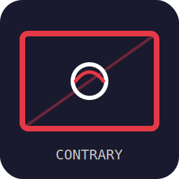

<p align="center">
  
</p>

<h1 align="center">Contrary Whiteboard</h1>

<p align="center">
  <strong>A full-featured digital whiteboard for Windows, macOS & Linux</strong><br>
  Built with Electron • React • Canvas 2D
</p>

<p align="center">
  <a href="https://github.com/AroseEditor/Contrary-Whiteboard/releases/latest">
    
  </a>
  <a href="https://github.com/AroseEditor/Contrary-Whiteboard/actions">
    
  </a>
  <a href="LICENSE">
    
  </a>
</p>

---

## Overview

**Contrary Whiteboard** is an open-source digital whiteboard application inspired by [OpenBoard](https://github.com/OpenBoard-org/OpenBoard). It provides a complete suite of drawing, annotation, and presentation tools — rebuilt from the ground up with modern web technologies.

- **Canvas-first rendering** — all drawing happens on HTML5 Canvas 2D for maximum performance
- **Multi-page documents** — organize content across unlimited pages with layer support
- **Presentation mode** — dual-display support for classroom and meeting presentations
- **Cross-platform** — native builds for Windows (NSIS), macOS (DMG), and Linux (AppImage)
- **Auto-updates** — checks GitHub Releases for new versions and self-updates

---

## Features

### Drawing Tools
| Tool | Description |
|------|-------------|
| ✏️ **Pen** | Freehand strokes with velocity-based pressure simulation, Bézier smoothing |
| 🖍️ **Highlighter** | Semi-transparent overlay strokes (~40% opacity) |
| 🧹 **Eraser** | Stroke-level erase (deletes entire strokes on contact) |
| 📏 **Line** | Straight lines with shift-lock (0°/45°/90°), configurable arrowheads |
| ⬜ **Shapes** | Rectangle, ellipse, triangle — filled or stroke-only |
| 🔤 **Text** | Rich text boxes with font, size, bold/italic/underline, color |
| 🔴 **Laser Pointer** | Red glowing dot that fades — no marks left on canvas |

### Canvas System
- **Infinite canvas** — pan with middle-mouse / Space+drag, zoom with Ctrl+scroll
- **Multi-page** — add, delete, duplicate, reorder pages
- **Layers** — background, drawing, annotation layers per page
- **Backgrounds** — solid color, grid, ruled lines, dot grid, custom image

### Object System
- Full **undo/redo** (command pattern, unlimited history)
- Copy / Paste / Cut / Duplicate / Group / Ungroup
- 8-point resize handles + rotation handle
- Right-click context menu with all operations
- Lock objects to prevent modification

### Media Import
- **Images** — PNG, JPG, SVG, GIF, BMP, WEBP (drag-and-drop + clipboard paste)
- **PDF** — import as raster pages, annotate over them

### Export
- **PNG / JPEG** — single page or all pages (1x, 2x, 4x resolution)
- **PDF** — multi-page export with correct DPI
- **SVG** — vector export of current page
- **OpenBoard (.ubz)** — compatible with OpenBoard format

### File Format
- Native `.cwb` format (JSON + JSZip)
- Auto-save every 60 seconds
- Crash recovery on startup

### Presentation
- **Dual display** — presenter view + audience view on secondary monitor
- **Fullscreen** (F11)
- **Blank screen** (B key) — hide content during presentations

### Auto-Update
- Checks GitHub Releases on startup
- Compares app version with latest release tag
- Downloads and runs the appropriate installer automatically

---

## Installation

### Download
Grab the latest release for your platform:

| Platform | Download |
|----------|----------|
| Windows | [Setup .exe (NSIS)](https://github.com/AroseEditor/Contrary-Whiteboard/releases/latest) |
| macOS | [.dmg](https://github.com/AroseEditor/Contrary-Whiteboard/releases/latest) |
| Linux | [.AppImage](https://github.com/AroseEditor/Contrary-Whiteboard/releases/latest) |

### Build from Source

```bash
# Clone
git clone https://github.com/AroseEditor/Contrary-Whiteboard.git
cd contrary-whiteboard

# Install dependencies
npm install

# Run in development mode
npm run dev

# Build for production (current platform)
npm run build
```

---

## Keyboard Shortcuts

| Action | Shortcut |
|--------|----------|
| Pen | `P` |
| Eraser | `E` |
| Select | `S` / `Escape` |
| Text | `T` |
| Line | `L` |
| Undo | `Ctrl+Z` |
| Redo | `Ctrl+Y` / `Ctrl+Shift+Z` |
| Copy | `Ctrl+C` |
| Paste | `Ctrl+V` |
| Cut | `Ctrl+X` |
| Duplicate | `Ctrl+D` |
| Select All | `Ctrl+A` |
| Delete | `Delete` / `Backspace` |
| Zoom In | `Ctrl+=` |
| Zoom Out | `Ctrl+-` |
| Zoom Fit | `Ctrl+0` |
| Next Page | `Page Down` |
| Prev Page | `Page Up` |
| New Page | `Ctrl+Shift+N` |
| Fullscreen | `F11` |
| Blank Screen | `B` |
| Save | `Ctrl+S` |
| Open | `Ctrl+O` |
| Export PDF | `Ctrl+Shift+E` |

---

## Project Structure

```
contrary-whiteboard/
├── .github/workflows/    # CI/CD build pipelines
├── main/                 # Electron main process
│   ├── main.js           # Entry point
│   ├── menu.js           # Native menu bar
│   ├── ipc-handlers.js   # IPC channel handlers
│   ├── file-manager.js   # File I/O (save/load/export)
│   ├── display-manager.js # Multi-monitor management
│   └── auto-updater.js   # GitHub release update checker
├── renderer/             # React UI + canvas engine
│   ├── store/            # Zustand state management
│   ├── components/       # React components
│   ├── tools/            # Drawing tool implementations
│   ├── commands/          # Undo/redo command pattern
│   ├── export/           # Export format handlers
│   └── utils/            # Geometry, bezier, hit testing
├── assets/               # Icons, fonts
├── package.json
├── webpack.config.js
└── electron-builder.config.js
```

---

## Tech Stack

- **Electron** — cross-platform desktop runtime
- **React 18** — UI component framework
- **Zustand** — lightweight state management
- **HTML5 Canvas 2D** — rendering engine
- **JSZip** — native file format packaging
- **jsPDF** — PDF export
- **Webpack 5** — module bundling

---

## License

MIT License — see [LICENSE](LICENSE) for details.

---

<p align="center">
  Built with ❤️ by the Contrary team
</p>
