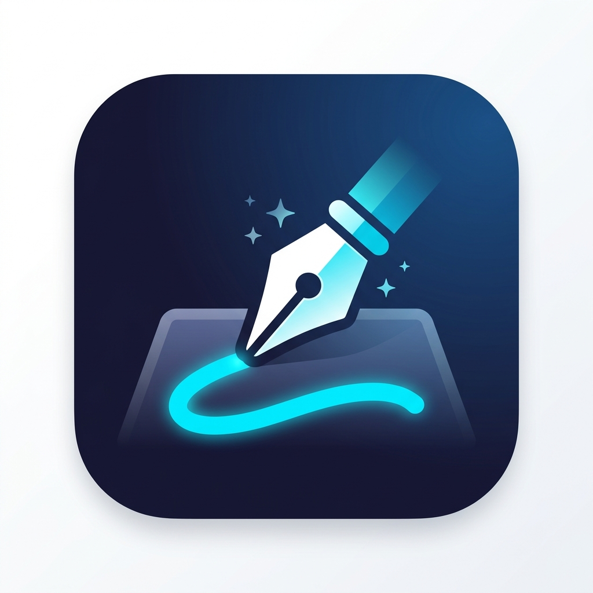

<p align="center">
  
</p>

<h1 align="center">Contrary Whiteboard</h1>

<p align="center">
  <a href="https://github.com/AroseEditor/Contrary-Whiteboard/releases/latest"></a>
  <a href="https://github.com/AroseEditor/Contrary-Whiteboard/releases"></a>
  <a href="https://github.com/AroseEditor/Contrary-Whiteboard/stargazers"></a>
  <a href="https://github.com/AroseEditor/Contrary-Whiteboard/blob/main/LICENSE"></a>
</p>

<p align="center">
  <b>A powerful, cross-platform interactive whiteboard for education and presentations.</b><br/>
  Built with C++ & Qt — fast, reliable, and feature-rich.
</p>

<p align="center">
  <sub>Fork of <a href="https://github.com/OpenBoard-org/OpenBoard">OpenBoard</a></sub>
</p>

---

## ✨ Features

- 🖊️ **Drawing Tools** — Pen, marker, eraser with pressure sensitivity and customizable widths
- 📐 **Geometry Tools** — Ruler, protractor, compass, triangle/set square, and axes
- 📝 **Text & Equations** — Rich text editing and mathematical equation input
- 📄 **PDF Import/Export** — Import PDFs as pages, export your board as PDF
- 🖼️ **Media Support** — Import images, audio, video directly onto the board
- 🎨 **Backgrounds** — White, black, grid, ruled paper, custom colors
- 📑 **Multi-page Documents** — Organize your work across unlimited pages
- 🌐 **Web Widgets** — Embed interactive web content directly on your board
- 🤖 **AI Assistant** — Built-in AI chatbot powered by Qwen 2.5 (optional, downloads on first use)
- 🖥️ **Dual Screen** — Present on a second display while controlling from your screen
- 🎙️ **Podcast/Recording** — Record your board sessions
- 🔄 **Auto-Update** — Automatic updates from GitHub Releases
- 🌍 **35+ Languages** — Full internationalization support

## 📥 Download

Pre-built installers are available for all platforms:

| Platform | Download |
|----------|----------|
| **Windows** (64-bit) | [ContraryWhiteboard-Setup.exe](https://github.com/AroseEditor/Contrary-Whiteboard/releases/latest) |
| **macOS** (Universal) | [ContraryWhiteboard.dmg](https://github.com/AroseEditor/Contrary-Whiteboard/releases/latest) |

## 🛠️ Building from Source

### Prerequisites
- **Qt 6.x** (with WebEngine, Multimedia, SVG modules)
- **CMake 3.16+**
- **C++17 compiler** (GCC 9+, MSVC 2019+, Clang 10+)
- **Dependencies**: Poppler, QuaZip, OpenSSL, zlib

### Build
```bash
git clone https://github.com/AroseEditor/Contrary-Whiteboard.git
cd Contrary-Whiteboard
mkdir build && cd build
cmake .. -DCMAKE_PREFIX_PATH=/path/to/Qt/6.x.x/gcc_64
cmake --build . -j$(nproc)
```

### Windows (with Qt Creator)
1. Open `ContraryWhiteboard.pro` in Qt Creator
2. Configure with your Qt kit
3. Build & Run

## 🤖 AI Assistant

Contrary Whiteboard includes an optional AI assistant powered by **Qwen 2.5 0.5B**. It's completely offline and private — the model runs locally on your machine.

- **Disabled by default** — Enable in Settings → AI
- **~300MB download** on first use (one-time)
- Ask questions, get explanations, brainstorm ideas — right from the board
- Docked panel on the right side

## 🎨 Custom Features (vs OpenBoard)

| Feature | OpenBoard | Contrary Whiteboard |
|---------|-----------|-------------------|
| Equation Tool | ❌ | ✅ |
| AI Assistant | ❌ | ✅ |
| Dark UI Theme | ❌ | ✅ |
| Auto-Update | Manual check | ✅ GitHub Releases |
| Modern Icons | Classic | ✅ Refreshed |

## 📜 License

Contrary Whiteboard is licensed under the **GNU General Public License v3.0**.

See [LICENSE](LICENSE) for full details.

## 👤 Author

**AroseEditor** — [@iusem](https://github.com/iusem)

<sub>Contrary Whiteboard is a fork of [OpenBoard](https://github.com/OpenBoard-org/OpenBoard), originally developed by the Open Education Foundation and DIP-SEM.</sub>