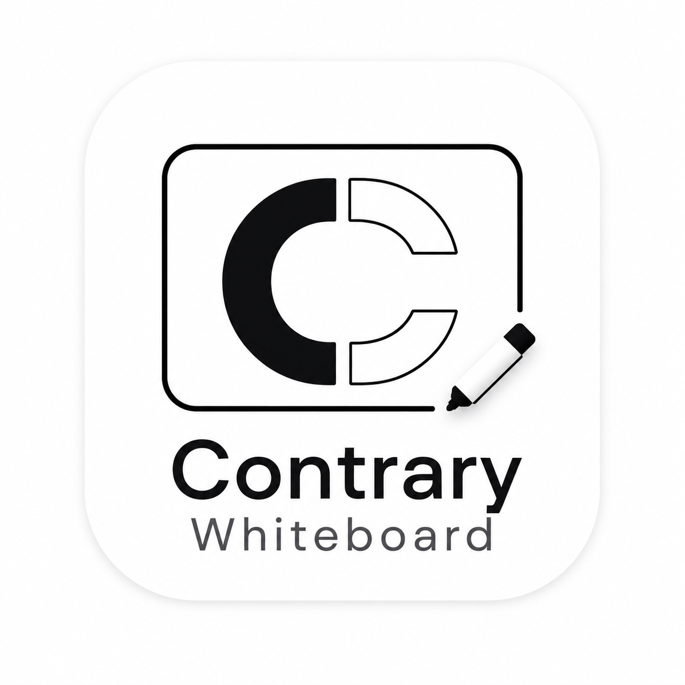

<p align="center">
  
</p>

<h1 align="center">Contrary Whiteboard</h1>

<p align="center">
  <a href="https://github.com/AroseEditor/Contrary-Whiteboard/releases/latest"></a>
  <a href="https://github.com/AroseEditor/Contrary-Whiteboard/releases"></a>
  <a href="https://github.com/AroseEditor/Contrary-Whiteboard/stargazers"></a>
  <a href="https://github.com/AroseEditor/Contrary-Whiteboard/blob/main/LICENSE"></a>
</p>

<p align="center">
  <b>A powerful, cross-platform interactive whiteboard for education and presentations.</b><br/>
  Built with C++ &amp; Qt — fast, reliable, and feature-rich.
</p>

<p align="center">
  <sub>Fork of <a href="https://github.com/OpenBoard-org/OpenBoard">OpenBoard</a></sub>
</p>

---

## ✨ Features

### 🖊️ Drawing Tools
- **Pen, Marker, Eraser** — Pressure-sensitive with customizable widths and colors
- **Line Tool** — Straight lines with configurable thickness
- **Highlighter/Marker** — Semi-transparent overlay strokes
- **Selector** — Move, resize, rotate any canvas object

### 📐 Geometry & Math
- Ruler, protractor, compass, triangle/set square, axes
- Rich text editing and mathematical equation input (LaTeX)

### 📄 Document & Media
- Import/export **PDFs** as pages
- Import **images, audio, video** directly onto the board
- **Multi-page documents** with unlimited pages
- Save and load in native **`.cwb`** (Contrary WhiteBoard) format

### 🌐 Live Collaboration — Host Whiteboard
- **One-click hosting** via [ngrok](https://ngrok.com) — generates a public URL instantly
- Guests join from any browser (PC, tablet, iPhone, Android — no install needed)
- **Real-time bidirectional sync**: host canvas → all guests, guest strokes → host canvas
- Both host and guests can **draw, erase, and add text** simultaneously
- **Live cursors** — see everyone's cursor in real time
- Guests can **follow the host view** (double-tap) or pan/zoom independently
- Pinch-to-zoom and touch drawing on mobile/iPad

### ⌨️ Keyboard Shortcuts
- `P` Pen · `E` Eraser · `M` Marker · `S` Selector · `T` Text · `G` Pointer · `J` Line
- `Ctrl+Z` Undo · `Ctrl+Y` Redo
- All shortcuts are **fully customizable** in Preferences → Controls

### 🎨 Themes & Appearance
- **Dark / Light mode** — switch instantly from Preferences
- Theme persists across restarts
- Backgrounds: plain, grid, ruled, white, black, custom color

### 🤖 AI Assistant
- Built-in AI chatbot powered by **Qwen 2.5 0.5B** — fully offline & private
- ~300 MB one-time download · Docked panel on the right side

### 🖥️ Presentation
- **Dual-screen** support — present on external display, control privately
- **Podcast/recording** — record your board sessions
- Laser pointer tool

### 🔧 Other
- **Auto-update** from GitHub Releases
- **35+ languages** — full internationalization
- **Stylus button mapping** — customize barrel/eraser buttons in Preferences → Controls

---

## 📥 Download

| Platform | Download |
|----------|----------|
| **Windows** (64-bit) | [ContraryWhiteboard-Setup.exe](https://github.com/AroseEditor/Contrary-Whiteboard/releases/latest) |
| **macOS** (Universal) | [ContraryWhiteboard.dmg](https://github.com/AroseEditor/Contrary-Whiteboard/releases/latest) |

---

## 🌐 Live Whiteboard Sharing — Quick Start

1. Open Contrary Whiteboard
2. Click **"Host Whiteboard"** in the toolbar
3. Follow the ngrok login prompt (one-time setup — creates a free account)
4. A public URL is copied to your clipboard automatically
5. Share it with anyone — they open it in a browser, no install required
6. Draw on your board → guests see it instantly
7. Guests draw → you see it on your Qt canvas in real time

> **Tip:** Guests can double-tap the canvas to sync their view to yours.

---

## 🛠️ Building from Source

### Prerequisites
- **Qt 6.8+** with modules: `WebEngine · Multimedia · SVG · WebSockets · OpenGL · UiTools`
- **MSVC 2022** (Windows) or **Clang** (macOS)
- **vcpkg** dependencies: Poppler, QuaZip, OpenSSL, zlib

### Windows
```bat
git clone https://github.com/AroseEditor/Contrary-Whiteboard.git
cd Contrary-Whiteboard
build_windows_classic.bat
```

### macOS
```bash
git clone https://github.com/AroseEditor/Contrary-Whiteboard.git
cd Contrary-Whiteboard
./build_macos.sh
```

### Qt Creator
1. Open `ContraryWhiteboard.pro`
2. Configure with your Qt 6.8 kit
3. Build & Run

---

## 🆚 Contrary Whiteboard vs OpenBoard

| Feature | OpenBoard | Contrary Whiteboard |
|---------|:---------:|:-------------------:|
| Native `.cwb` file format | ❌ | ✅ |
| Dark UI theme | ❌ | ✅ |
| Live collaboration (ngrok) | ❌ | ✅ |
| Mobile guest support | ❌ | ✅ |
| Real-time cursor sync | ❌ | ✅ |
| Customizable keyboard shortcuts | ❌ | ✅ |
| Stylus button mapping | ❌ | ✅ |
| AI Assistant (offline) | ❌ | ✅ |
| Auto-update | Manual | ✅ GitHub Releases |
| Equation tool | ❌ | ✅ |

---

## 🔧 Technical Architecture (for developers)

### Stack overview

| Layer | Technology |
|-------|-----------|
| Language | **C++17** |
| UI Framework | **Qt 6.8** (Widgets + QML for web views) |
| Build system | **qmake** (`.pro` / `.pri` module files) |
| CI/CD | **GitHub Actions** → NSIS installer (Windows), DMG (macOS) |
| Packaging | `aqtinstall` for Qt, `vcpkg` for native deps |
| Native deps | Poppler (PDF), QuaZip, OpenSSL, zlib (via vcpkg) |

---

### Module layout

```
src/
├── core/          # Application bootstrap, settings, persistence
├── board/         # Board controller, board view (QGraphicsView subclass)
├── domain/        # QGraphicsScene subclass + all graphics items
├── gui/           # Main window, palettes, toolbars, theme, AI panel
├── sharing/       # WebSocket collaboration server + ngrok manager
├── adaptors/      # SVG/UBZ import-export, PDF rendering
├── document/      # Document model, proxy, page management
├── tools/         # Geometric drawing tools (ruler, compass, etc.)
├── web/           # Embedded browser (QtWebEngine simplebrowser fork)
└── frameworks/    # Utilities: crypto, platform, file system

resources/
├── OpenBoard.qrc  # All images, SVGs, HTML pages embedded as Qt resources
├── forms/         # .ui files (Qt Designer XML) for dialogs/main window
└── web/
    └── whiteboard.html  # Self-contained browser client for collaboration
```

---

### Core classes

#### `UBApplication` (`src/core/UBApplication.cpp`)
Subclasses `QApplication`. Owns the global event filter (`eventFilter()`), wires all controllers at startup in `init()`, and manages the application lifecycle. The event filter intercepts:
- `KeyRelease` → `UBShortcutManager::handleKeyReleaseEvent()`
- `TabletPress` → `UBShortcutManager::handleTabletEvent()`
- `MouseButtonPress` → `UBShortcutManager::handleMouseEvent()`

#### `UBBoardController` (`src/board/`)
Central controller for the whiteboard mode. Manages the active `UBGraphicsScene`, handles page navigation, and owns `UBBoardView` (the main `QGraphicsView`). Exposes `activeScene()` → `std::shared_ptr<UBGraphicsScene>`.

#### `UBGraphicsScene` (`src/domain/`)
Subclasses `QGraphicsScene`. All drawing items live here as `QGraphicsItem` subclasses:
- `UBGraphicsPolygonItem` — pen/marker strokes (collected into `UBGraphicsStrokeItem`)
- `UBGraphicsTextItem` — text boxes
- `UBGraphicsPixmapItem` / `UBGraphicsSvgItem` — images
- `UBGraphicsPDFItem` — PDF pages rendered via Poppler
- Tool overlays (ruler, protractor, compass) as `UBGraphicsCurtainItem`, etc.

#### `UBDrawingController` (`src/board/`)
Singleton managing the active `UBStylusTool` enum value. All tool-switching actions connect to `setStylusTool(int)`. Tablet events from `UBBoardView` pass through here to decide draw vs erase vs select.

#### `UBShortcutManager` (`src/core/`)
`QAbstractTableModel` subclass. Manages three orthogonal input mappings:
- `QAction::shortcut` → keyboard shortcuts (persisted under `Shortcut/<actionName>`)
- `mMouseActions[Qt::MouseButton]` → mouse button → action
- `mTabletActions[Qt::MouseButton]` → stylus barrel button → action

`ignoreCtrl(bool)` strips `Qt::CTRL` from all non-built-in shortcuts, enabling bare-key mode (`P` instead of `Ctrl+P`). Exposed as a `QAbstractTableModel` and rendered in **Preferences → Controls** via `QTableView`.

#### `UBSettings` (`src/core/`)
Thin wrapper around `QSettings` (INI file). Exposes named `UBSetting*` members (observable wrappers with `get()`/`set()`). Custom keys added by Contrary Whiteboard:
- `appTheme` — `"Light"` / `"Dark"`
- `Shortcut/*` — serialized as `QStringList{keySequence, mouseButton, tabletButton}`
- `Shortcut/IgnoreCtrl` — bool
- `AI/enabled` — bool

---

### File format — `.cwb` (Contrary WhiteBoard)

`.cwb` is a renamed `.ubz` archive (ZIP container). Internal structure:

```
document.cwb  (ZIP)
├── manifest.rdf          # Dublin Core metadata: title, date, size
├── session.xml           # Page order, current page index
└── pages/
    ├── page0001.svg       # QGraphicsScene serialized as SVG
    ├── page0001.thumbnail.jpg
    ├── page0002.svg
    └── ...
```

Each page SVG contains OpenBoard's custom SVG namespace (`ub:`) for non-standard attributes (z-order, interactivity flags, tool metadata). Import/export handled by `UBSvgSubsetAdaptor`.

File association registered in the NSIS installer (`.cwb` → `ContraryWhiteboard.exe "%1"`).

---

### Theme system — `UBThemeManager` (`src/gui/`)

Applies theme in two passes:
1. **`QPalette`** — affects native Qt widget rendering (borders, focus rings, disabled states)
2. **`QApplication::setStyleSheet()`** — full QSS override covering every widget class explicitly

Dark mode QSS targets: `QMenuBar`, `QMenu`, `QToolBar`, `QToolButton`, `QDialog`, `QTabWidget`, `QLineEdit`, `QTextEdit`, `QComboBox`, `QPushButton`, `QLabel`, `QGroupBox`, `QCheckBox`, `QRadioButton`, `QSlider`, `QScrollBar`, `QListView`, `QTreeView`, `QTableView`, `QHeaderView`, `QToolTip`, `QSplitter`, `QProgressBar`, `QStatusBar`, `QDockWidget`.

`QGraphicsView` / `QGraphicsScene` background intentionally excluded — controlled by board logic.

Theme persisted in `UBSettings` → `appTheme`. Applied at startup before `mainWindow->show()`.

---

### Live collaboration — `src/sharing/`

#### Architecture

```
Host (Qt app)                              Guest (browser)
─────────────────                          ───────────────
UBSharingController                        whiteboard.html
      │                                          │
      │  toggleHosting()                         │
      ▼                                          │
UBSharingServer ─── QTcpServer (port 8080) ──── │
      │         ─── QWebSocketServer             │
      │                    │                     │
      ▼                    │  WebSocket /ws       │
UBNgrokManager             └──────────────────► ws.onmessage
(ngrok subprocess)
      │
      ▼
  public URL → clipboard
```

#### TCP routing (single port)

`QTcpServer::newConnection` peeks first 2KB of each TCP socket:
- Contains `GET /ws` + `Upgrade: websocket` → `QWebSocketServer::handleConnection(socket)` (HTTP upgrade handled internally by Qt)
- Any other `GET` → serve `whiteboard.html` from Qt resources (`:/web/whiteboard.html`)

This lets ngrok tunnel a **single port** for both page serving and WebSocket.

#### Host → Guest sync

`QGraphicsScene::changed` (fires on any item add/modify/remove) triggers a 250ms debounce timer. On fire:
1. `scene->render(&painter, QRectF(), scene->sceneRect())` → `QImage` (max 1600px long side)
2. JPEG encode at quality 70 → base64
3. Broadcast `{type:"snapshot", data:"<base64>", w:N, h:N}` to all WebSocket clients

New guests (`hello` message) receive an `init` packet that also carries `sceneX/Y/W/H` for the browser to set up its coordinate transform.

#### Guest → Host sync

Browser sends events in **scene coordinates** (same space as Qt's `QGraphicsScene`):
- `{type:"draw", x, y, x2, y2, color, width}` → `scene->addLine(x,y,x2,y2, QPen(color,width,RoundCap))`
- `{type:"erase", x, y, radius}` → `scene->addEllipse(...)` with white fill + `ZValue(1000)`
- `{type:"text", x, y, content, color}` → `scene->addText(content)` positioned at `(x,y)`

Events are also relayed by the server to all other guests (`broadcast(ev, sender)`).

#### Cursor sync

- **Host → Guests**: `UBCursorRelay` (event filter on `UBBoardView::viewport()`) captures `MouseMove`, maps viewport pos to scene coords via `QGraphicsView::mapToScene()`, broadcasts `{type:"cursor", id:"host", x, y, color:"#4285f4"}` throttled to 20 fps.
- **Guests → Host**: `{type:"cursor", id, x, y, color}` from browser → `QLabel` floating overlays on the board view viewport, positioned via `view->mapFromScene(QPointF(x,y))`.

#### ngrok manager (`UBNgrokManager`)

- Downloads the ngrok binary from `https://bin.equinox.io/` on first use, stored in `QStandardPaths::AppDataLocation`
- Runs `ngrok authtoken <token>` interactively (launches a dialog prompting the user to paste their token from `dashboard.ngrok.com`)
- Runs `ngrok http <port> --log stdout --log-format json` as `QProcess`
- Parses JSON log lines for `"url":"https://..."` → emits `urlReady(url)`

---

### AI assistant — `src/gui/`

#### Backend (`UBAIBackend`)

Downloads **Qwen2.5-0.5B-Instruct.Q4_K_M.llamafile** (~350MB) from HuggingFace (`Mozilla/Qwen2.5-0.5B-Instruct-llamafile`) on first use. Llamafile is a self-contained executable: model weights bundled into a PE/ELF binary via GGUF format + llama.cpp runtime.

Startup sequence:
1. `QNetworkAccessManager` GET → stream to disk with progress
2. On Windows: run as `cmd.exe /c <path> --server --port 8742 --nobrowser --ctx-size 2048`
3. Watch `QProcess::readyReadStandardOutput` for `"HTTP server listening"` → emit `serverStarted()`
4. Chat: POST `/v1/chat/completions` with `stream:true` → parse SSE `data: {...}` lines → emit `messageChunk(delta)` per token

#### Chat panel (`UBAIChatPanel`)

`QWidget` added to the central widget's `QVBoxLayout` at the bottom, hidden by default. Toggled by `actionAIAssistant`. Uses `QTextBrowser` for message history (HTML bubbles), `QLineEdit` + `QPushButton` for input. Streaming tokens are appended directly via `QTextCursor` to the last AI bubble in the `QTextDocument`.

---

## 📜 License

Contrary Whiteboard is licensed under the **GNU General Public License v3.0**.  
See [LICENSE](LICENSE) for full details.

---

## 👤 Author

**AroseEditor** — [@AroseEditor](https://github.com/AroseEditor)

<sub>Contrary Whiteboard is a fork of <a href="https://github.com/OpenBoard-org/OpenBoard">OpenBoard</a>, originally developed by the Open Education Foundation and DIP-SEM.</sub>
